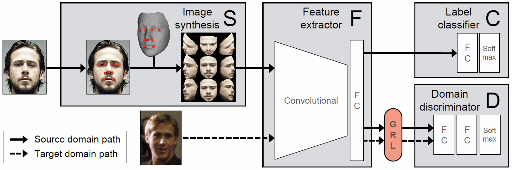
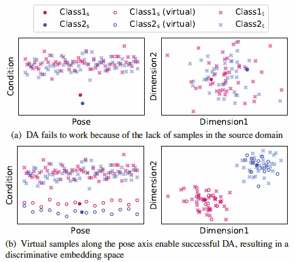

SSPP-DAN in Tensorflow
====

Tensorflow implementation of [SSPP-DAN: Deep Domain Adaptation Network for Face Recognition with Single Sample Per Person][arxiv]
[arxiv]: https://arxiv.org/abs/1702.04069




Prerequisites
-------------
* [Python 2.7] [python]
* [Tensorflow 0.12] [tf] 
* [OpenCV 2.4.9] [cv]
* [NumPy] [np]
* [SciPy] [sp]
[python]: https://www.python.org/downloads/
[tf]: https://www.tensorflow.org/versions/r0.12/
[cv]: http://opencv.org/releases.html
[np]: http://www.numpy.org/
[sp]: https://www.scipy.org/install.html

Usage
-------------

First, download the [dataset] [gd] or the [pickle files] [pkl] that we have already created from our repository. After all pickle files are download, move them into the SSPP-DAN/data folder.
[gd]: https://drive.google.com/uc?id=0ByHRRxErVc0NRjFzTXhRSUlyZlU&export=download
[pkl]: https://drive.google.com/uc?id=0ByHRRxErVc0NNFFINFJ2MXlvTGs&export=download

To train a model with downloaded dataset:
```python
$ python train_model.py --learning_rate=1e-5 --batch_size=50 --save_step=100
```

To test with an existing model:
```python
$ python test_model.py --summaries_dir 'expr/F3D_30_60_FC6_FC6' --test_batch_size=50
```

Results
-------------
Facial feature space (left) and its embedding space after applying DA (right). The subscript “s” and “t” in the
legend refer to the source and target domains, respectively.



Author
------------
Sungeun Hong / @[csehong][wp]
[wp]: sites.google.com/site/csehong


